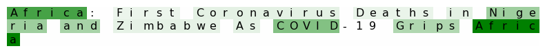
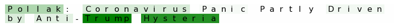
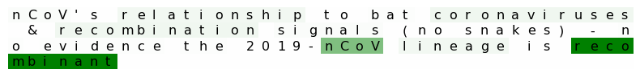

# Analyzing News Articles about the Coronavirus
In this project we apply deep learning techniques to analyze a dataset of news articles related to the Coronavirus. Our dataset contains approximately 2 million news articles from over 50,000 news sites from around the world. In total there are 20 languages represented.

### Predicting News Sources From Headline
The first goal of the analysis was to build a classifier to predict the most likely news source given a title of an article related to the coronavirus. We build this classifier by training an 8 layer GRU neural network with gradient clipping and a hidden layer size of 512.

Below are the top 10 predictions from our model given various article titles.

`Africa: First coronavirus deaths in Nigeria and Zimbabwe as Covid-19 grips Africa`

    0 coronavirus.dev (0.24)
    1 www.independent.co.uk (0.04)
    2 www.scmp.com (0.03)
    3 thehill.com (0.02)
    4 www.primenewsghana.com (0.02)
    5 allafrica.com (0.01)
    6 qz.com (0.01)
    7 coronavirusreport.com (0.01)
    8 www.expressiveinfo.com (0.01)
    9 thepattayanews.com (0.01)

`Pollack: Coronavirus Panic Partly Driven by Anti-Trump Hysteria`

    0 www.infowars.com (0.06)
    1 fromthetrenchesworldreport.com (0.04)
    2 blackchristiannews.com (0.03)
    3 crossman66.wordpress.com (0.03)
    4 ussanews.com (0.02)
    5 thewatchtowers.org (0.01)
    6 reason.com (0.01)
    7 www.commondreams.org (0.01)
    8 radio.foxnews.com (0.01)
    9 theduran.com (0.01)

`nCoV’s relationship to bat coronaviruses & recombination signals (no snakes) - no evidence the 2019-nCoV lineage is recombinant`

    0 virological.org (0.49)
    1 www.businessinsider.com (0.04)
    2 www.insider.com (0.02)
    3 contagiontracker.com (0.02)
    4 www.en24.news (0.02)
    5 dcdirtylaundry.com (0.01)
    6 news.yahoo.com (0.01)
    7 newsrnd.com (0.01)
    8 polar-ocean-4195.herokuapp.com (0.01)
    9 reddit.unblockweb.cc (0.01)

### Different types of Bias
Considering the title of article and then looking at our models predictions gives us a way to qualitatively asses how our model is doing, but does not tell us anything about how our model came to its conclusions. In order to gain a better understanding of how our model makes its predictions we implement the sliding window algorithm. This method works by replacing one word from a given article's title with a blank and then computing predictions for this new title (without one of the words). We can then compare the euclidean distance between the two output tensors to get a score which tells us how important that word was in making the models prediction. We can repeat this process for each word in a given title to see which words our model relied on most to make its prediction.

These visualizations generated with the sliding window algorithm help us to see the different types of bias in our model. Darker green highlighting indicates greater euclidean distance between the output tensors with and without that word. Thus, darker highlighting indicates greater importance in the model's decision making process.

#### Geographic

#### Political Bias

#### Topical Bias

