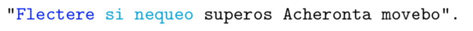
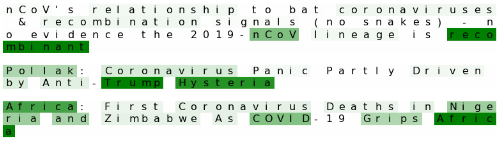
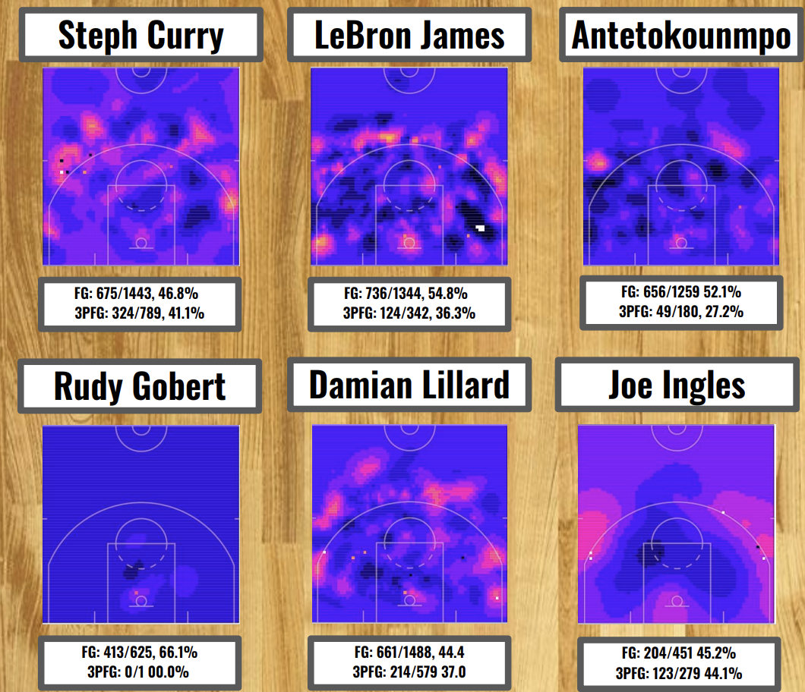

## [Learning Word Embeddings for a Latin Corpus](LatinEmbeddings.md)
<!-- #### April 2020 -->

---

## [Analyzing News Articles about the Coronavirus](Coronavirus-News.md)
<!-- #### April 2020 -->

---

## [Simulating a National XC Meet](xc-simulating.md)
<!-- #### December 2019 -->

---

## [Visualizing NBA Player Scoring Efficiency with Spatial Kriging](NBA-heatmaps.md)
<!-- #### April 2019 -->

---
