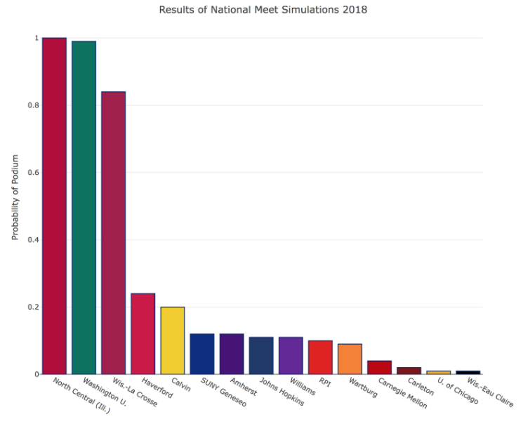
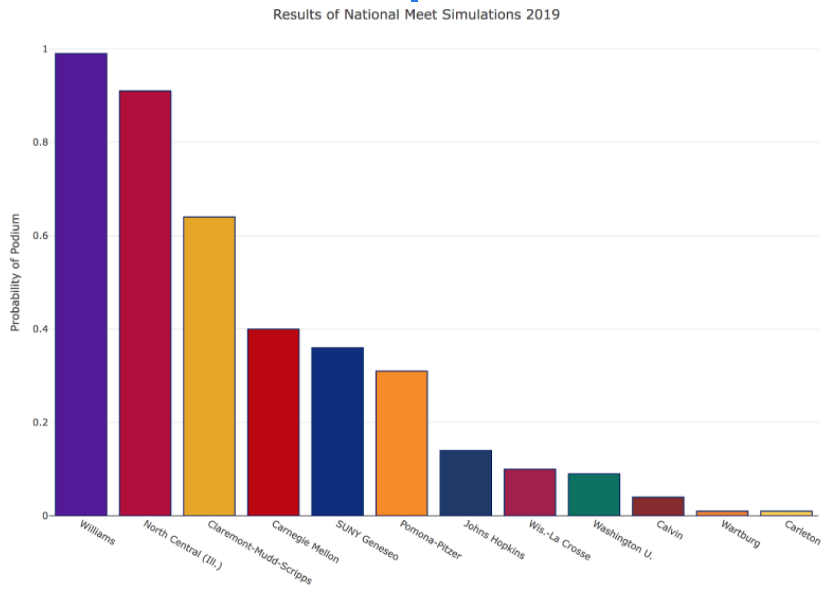
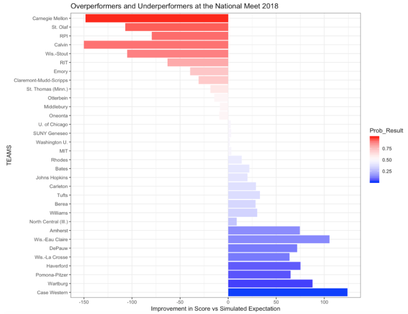
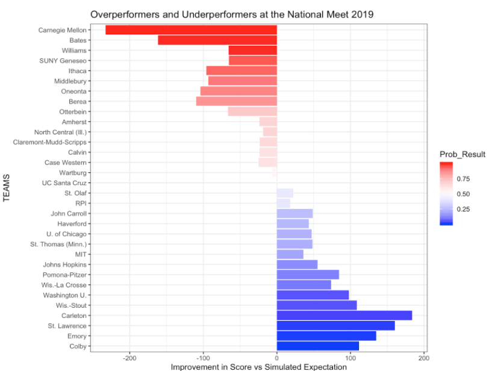

# Simulating a NCAA DIII National XC Meet
Ethan Ashby, Danny Rosen, Nate Stringham

This project was completed for Math 154 - Computational Statistics in Fall 2019.  
All race data was obtained from [tffrs](https://tfrrs.org/)

See also
* a [simulation applet](https://n8stringham.shinyapps.io/CrossCountry_Simulator)
* the [poster](xc-simulating/Math154-FinalProject-Slides.pdf) we made for our presentation
* an [in depth discussion](xc-simulating/TeamRunning-FinalWriteUp.html) of methods and results

### Goals
* Successfully simulate a national championship meet using prior race results.
* Analyze these simulations to assess how well different college programs "peak"
 
### Background
In NCAA Division III Cross Country, runners compete in an 8k race with the top 5 finishers from each team contributing to the overall team score. Specifically, a team score is calculated by taking a sum of the  places of the top 5 finishers from each team. The team with the lowest score wins the meet.

Each year every team in NCAA DIII vies for one of 32 spots in the National Championship Meet. Those that qualify send 7 runners to compete in this meet for the title of national champions. Many teams structure their training plan in an effort to ensure that their fitness is highest immediately leading up to this meet through a process colloquially referred to as *peaking*. While methods vary across coaching staffs and teams, the ability of a cross country program to peak its runners well at the end of the season is often what determines national champions. By simulating a meet and comparing the simulations to both the pre-meet rankings and the actual results we hope to gain insight into which programs actually peaked at the national meet. 

### Method
 To run the simulation, we first standardize the times run at various races leading up to the national meet for each athlete on a qualifying team. These adjusted times from the current season are used to create a normal distribution for each athlete; then, to simulate a national meet we simply sample from each athlete's distribution to get their national meet performance. These results can then be scored as a cross country meet. We compare the actual nationals result from that year to our simulated result to determine how well a team peaked. We assign a score to each program based on how consistently they peaked at the national meet and how far they exceeded our simulated expectation of their finish at the national meet.

### Some Results
We performed this process of simulating for both the 2018 and 2019 seasons. The plots below show our predicted probability for a team to finish on the podium (top 4) at the national meet.

By comparing these predictions to the actual results of the meet, we produced the following plots illustrating over-performers and under-performers from the meet.

 

For a more in depth discussion of methods and results, see [here](xc-simulating/TeamRunning-FinalWriteUp.html)

			
